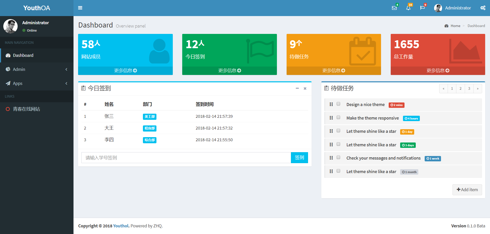
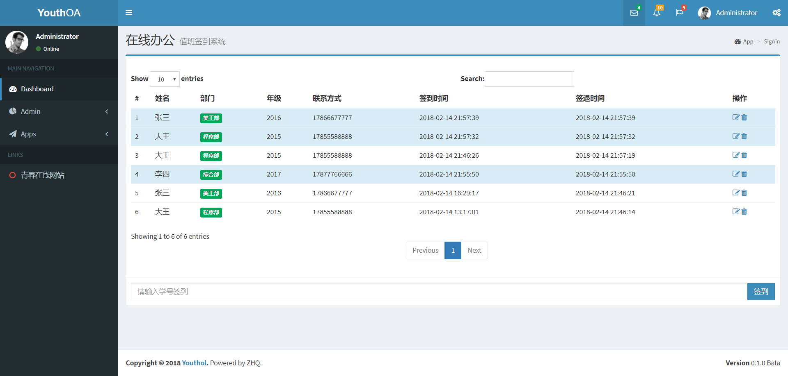
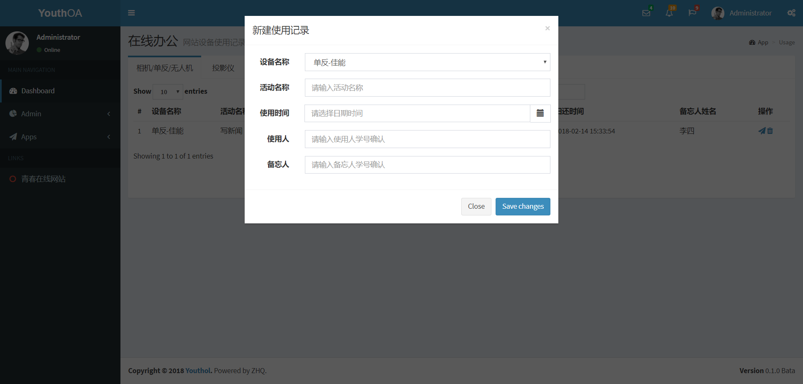

# YouthOA

## 介绍

基于 [AdminLTE](https://github.com/almasaeed2010/AdminLTE) 的后台模板样式，在 Laravel 基础上集成基本的用户模块，其余的功能模板可根据实际项目需求添加。

## 效果图

- 后台首页



- 功能模块



- 添加数据



## 功能

- 值班签到功能
- 日程安排记录
- 设备使用记录
- 工作量统计

## 待完成

- 首页 Small box 接入数据库
- 首页 Todo list 接入数据库
- 签到系统数据导入
- 各功能数据导出
- 用户、角色、权限管理
- 登录、登出
- 危险操作后台验证
- 分离出各应用公共部分
- 校内联系方式快捷查询

## 安装

1. 克隆资源库

   ```bash
   git clone https://github.com/syessn/youthoa-laravel.git
   ```

2. 安装依赖关系

   ```bash
   composer install
   ```

3. 复制配置文件

   ```bash
   cp .env.example .env
   ```

4. 创建新的应用程序密钥

   ```bash
   php artisan key:generate
   ```

5. 运行数据库迁移

   ```bash
   php artisan migrate
   ```

6. 运行数据填充

   ```bash
   php artisan db:seed
   ```

   ​